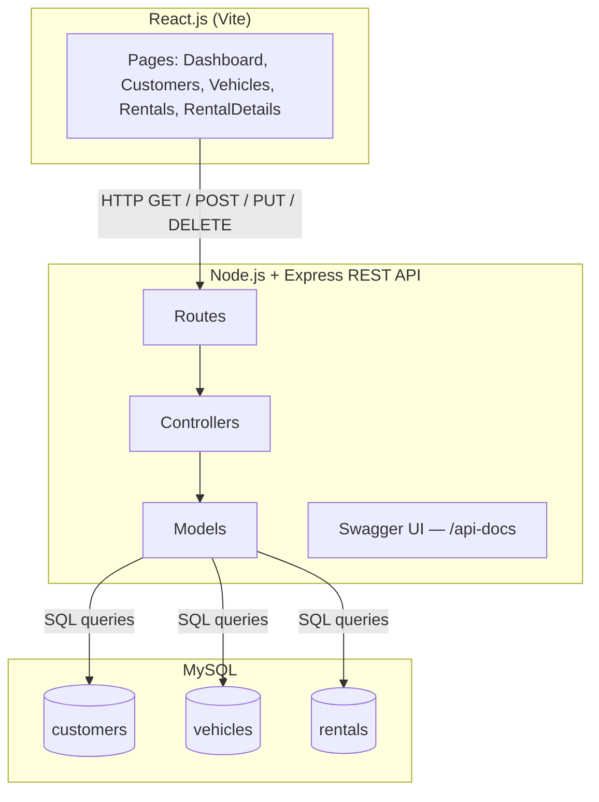
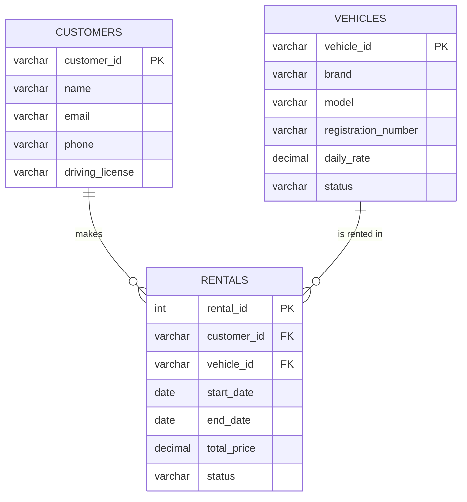
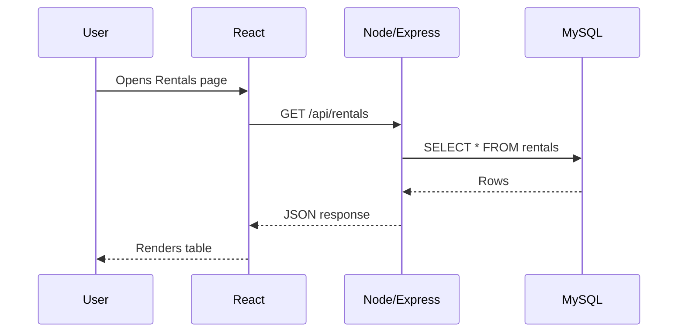
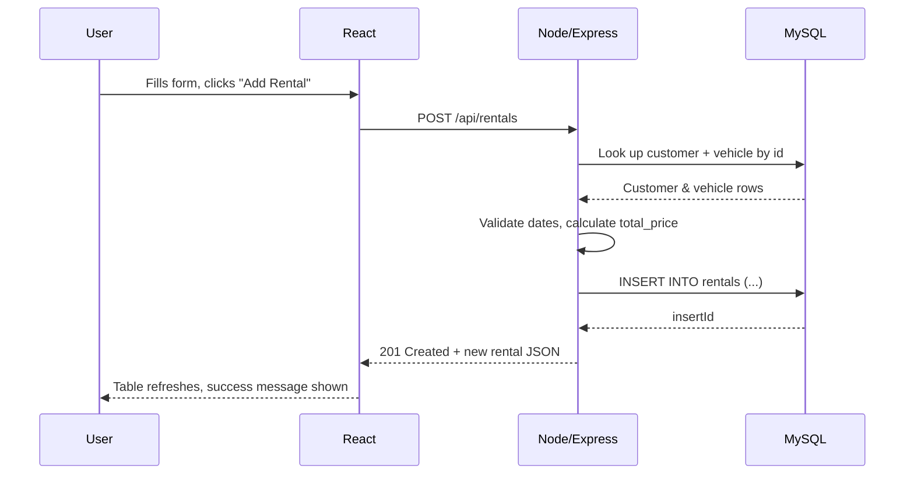

# Vehicle Rental Management System

Full-Stack Web Development Summative Group Project — **Group C**
React.js · Node.js/Express · MySQL · Swagger

## About

A vehicle rental company needs a way to keep track of who's renting what, and for how long. This app lets staff register customers, manage the vehicle fleet, and create, update, and cancel rental bookings — with rental pricing calculated automatically from each vehicle's daily rate rather than typed in by hand.

## Team

| Member | Owns |
|---|---|
| [Teammate's Name] | Customers & Vehicles — database, API, React pages |
| Deen (Sherif Mohammed Sumaila) | Rentals & Dashboard — database, API, React pages |

## Tech Stack

- **Frontend:** React.js (Vite) + React Router
- **Backend:** Node.js + Express.js
- **Database:** MySQL
- **API Docs:** Swagger (OpenAPI 3.0)

## Features

- **Dashboard** — live counts of customers, vehicles, and rentals, plus active rentals and available vehicles
- **Customers** — full CRUD
- **Vehicles** — full CRUD
- **Rentals** — full CRUD; validates that the linked customer and vehicle actually exist, checks `end_date` is after `start_date`, and automatically calculates `total_price` from the vehicle's daily rate × number of rental days
- **Rental Details** — a single rental's info alongside the customer and vehicle it belongs to
- **Swagger UI** — every endpoint documented and testable at `/api-docs`

## Architecture

The frontend never talks to MySQL directly — everything goes through the Express API.



## Database Design

`rentals` is the join point between `customers` and `vehicles` — every rental must reference a real customer and a real vehicle.



## Request Flows

**Reading data** (e.g. opening the Rentals page):



**Creating data** (e.g. adding a new rental):



## Project Structure

```
project-root/
├── backend/
│   ├── config/database.js
│   ├── controllers/
│   ├── models/
│   ├── routes/
│   ├── swagger/swagger.js
│   ├── database/schema.sql
│   └── app.js
└── frontend/
    └── src/
        ├── components/Navbar.jsx
        ├── pages/
        └── services/api.js
```

## How to run the program

### Prerequisites
- Node.js (v18+)
- MySQL Server
- npm

### 1. Database
Run `backend/database/schema.sql` in your MySQL client. It creates the `vehicle_rental_db` database, all three tables, and seeds each with sample data.

### 2. Backend
```bash
cd backend
npm install
```
Create a `.env` file in `backend/`:
```
DB_HOST=localhost
DB_USER=root
DB_PASSWORD=your_mysql_password
DB_NAME=vehicle_rental_db
DB_PORT=3306
PORT=3000
```
Then:
```bash
node app.js
```


- API base: http://localhost:3000/api
- Swagger docs: http://localhost:3000/api-docs

Here it is actually answering requests — a real dashboard-stats call, and a rental being created with `total_price` worked out automatically (4 days × $40/day = $160):


### 3. Frontend
```bash
cd frontend
npm install
npm run dev
```


- App: http://localhost:5173

## Known Issues We Caught (and Fixed)

While putting this README together we actually ran `npm run build` on the frontend and it failed:


The cause: the entire `Rentals.jsx` component had accidentally been pasted into `services/api.js` instead of just the five `fetch` helper functions (`getRentals`, `getRentalById`, `createRental`, `updateRental`, `deleteRental`). Once that block was replaced with the actual API functions, the build passed cleanly:


**Takeaway for the demo:** if `Rentals.jsx` or `RentalDetails.jsx` ever throw `"getRentals is not a function"` (or similar) in the browser console, check `services/api.js` first — it's an easy file to end up with the wrong block pasted into it.

## API Reference

| Resource | Endpoints |
|---|---|
| Customers | `GET /api/customers` · `GET /api/customers/:id` · `POST /api/customers` · `PUT /api/customers/:id` · `DELETE /api/customers/:id` |
| Vehicles | `GET /api/vehicles` · `GET /api/vehicles/:id` · `POST /api/vehicles` · `PUT /api/vehicles/:id` · `DELETE /api/vehicles/:id` |
| Rentals | `GET /api/rentals` · `GET /api/rentals/:id` · `POST /api/rentals` · `PUT /api/rentals/:id` · `DELETE /api/rentals/:id` |
| Dashboard | `GET /api/dashboard/stats` |

Full request/response schemas, parameters, and a "try it out" console for every endpoint are in Swagger at `/api-docs` once the backend is running.

## Assessment Criteria Coverage

| Criteria | Marks | Where |
|---|---|---|
| Database design and relationships | 15 | `schema.sql` — 3 related tables, FKs on `rentals` |
| Node.js / Express API | 20 | `controllers/`, `models/`, `routes/`, `config/database.js` |
| CRUD operations | 15 | Full CRUD on all 3 resources (15 endpoints total) |
| Swagger documentation | 10 | `/api-docs`, JSDoc blocks in every route file |
| React.js frontend | 15 | `pages/` — `useState`/`useEffect`, forms, tables |
| React Router and navigation | 5 | `App.jsx`, `Navbar.jsx` |
| Frontend/API integration | 10 | `services/api.js` |
| User interface and usability | 5 | `index.css` design system |
| Demonstration and code explanation | 5 | Recorded demo |